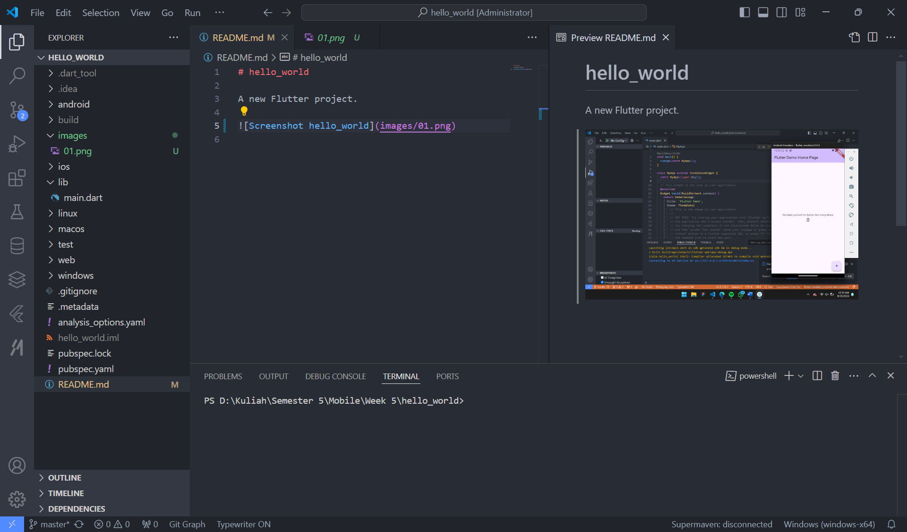

# 06 | Widget Dasar Flutter

Nama: Ahmad Taufiq Hidayatulloh<br>
NIM: 2241720207<br>
Kelas: TI-3D<br>

# hello_world

A new Flutter project.


## Tugas Praktikum
### Soal 1

Selesaikan Praktikum 1 sampai 4, lalu dokumentasikan dan push ke repository Anda berupa screenshot setiap hasil pekerjaan beserta penjelasannya di file `README.md`!

#### Praktikum 1 - Langkah 1


#### Praktikum 1 - Langkah 2


#### Praktikum 1 - Langkah 3


#### Praktikum 1 - Langkah 4


#### Praktikum 2 - Langkah 1


#### Praktikum 2 - Langkah 2


#### Praktikum 2 - Langkah 3


#### Praktikum 2 - Langkah 4


#### Praktikum 2 - Langkah 5


#### Praktikum 2 - Langkah 6


#### Praktikum 2 - Langkah 7


#### Praktikum 2 - Langkah 8


#### Praktikum 2 - Langkah 9


#### Praktikum 2 - Langkah 10


#### Praktikum 2 - Langkah 11


#### Praktikum 2 - Langkah 12


#### Praktikum 3 - Langkah 1


#### Praktikum 3 - Langkah 2


#### Praktikum 4 - Langkah 1


#### Praktikum 4 - Langkah 2


#### Praktikum 4 - Langkah 3


#### Praktikum 4 - Langkah 4


#### Praktikum 4 - Langkah 5


#### Praktikum 4 - Langkah 6


### Soal 2

Pada praktikum 4 mulai dari Langkah 3 sampai 6, buatlah file widget tersendiri di folder `basic_widgets`, kemudian pada file `main.dart` cukup melakukan import widget sesuai masing-masing langkah tersebut!
**Jawab**: 


### Soal 3

Jelaskan jenis-jenis parameter di Functions beserta contoh sintaksnya!
**Jawab**:
Jenis-jenis parameter di Functions dapat dibagi menjadi 2 jenis yaitu positional parameters dan named parameters.<br>
-> Positional parameters adalah parameter yang diisi dengan urutan.
```
void printInfo(String name, int age) {
  print("Nama: $name, Umur: $age");
}

void main() {
  printInfo("Ahmad Taufiq Hidayatulloh", 17);
}
```
-> Named parameters adalah parameter yang diisi dengan nama.
```
void printInfo({String? name, int? age}) {
  print("Nama: $name, Umur: $age");
}

void main() {
  printInfo(name: "Ahmad Taufiq Hidayatulloh", age: 17);
}
```
-> Optional parameters adalah parameter yang dapat diisi atau tidak.
```
void printInfo(String name, [int? age]) {
  print("Nama: $name, Umur: $age");
}

void main() {
  printInfo("Ahmad Taufiq Hidayatulloh"); // Tanpa age
  printInfo("Ahmad Taufiq Hidayatulloh", 17); // Dengan age
}
```

### Soal 4
Jelaskan maksud Functions sebagai first-class objects beserta contoh sintaknya!

**Jawab**:
First-class objects adalah objek yang dapat dibuat dari fungsi.
```
void sayHello() {
  print('Hello!');
}

void main() {
  var greet = sayHello;  // Fungsi disimpan dalam variabel
  greet();               // Memanggil fungsi melalui variabel

  List<void Function()> functions = [sayHello];  // Disimpan dalam list
}
```

### Soal 5
Apa itu Anonymous Functions? Jelaskan dan berikan contohnya!

**Jawab**:
Anonymous Functions adalah fungsi yang tidak memiliki nama. Fungsi tersebut dapat dibuat dengan menggunakan tanda kurung kurawal ().
```
void main() {
  var greet = () {
    print('Hello!');
  };
  greet();
}
```

### Soal 6
Jelaskan perbedaan Lexical scope dan Lexical closures! Berikan contohnya!

**Jawab**:
- Lexical Scope engacu pada aturan bahwa variabel yang dideklarasikan di dalam suatu scopem hanya dapat diakses dalam scope tersebut dan scope yang lebih dalam.
```
void main() {
  int outerVar = 10;
  
  void innerFunction() {
    print(outerVar);  // Bisa mengakses variabel dari outer scope
  }

  innerFunction();
}
```
- Lexical Closure Adalah kemampuan fungsi untuk "mengingat" variabel dari scope luar di mana fungsi tersebut didefinisikan, meskipun fungsi tersebut dijalankan di luar scope asalnya.
```
Function makeMultiplier(int factor) {
  return (int value) {
    return factor * value;  // Menyimpan 'factor' meski dipanggil di luar
  };
}

void main() {
  var multiplyBy2 = makeMultiplier(2);
  print(multiplyBy2(5));  // Output: 10
}
```

### Soal 7
Jelaskan dengan contoh cara membuat return multiple value di Functions!

**Jawab**:
Return multiple value di Functions dapat dilakukan dengan menggunakan tipe data Record. Tipe data Record adalah (Type, Type) yang berisi nilai yang dikembalikan dari fungsi.
```
(int, String) multipleReturn() {
  return (1, "halo");
}

void main() {
  print(multipleReturn()); // Output: (1, halo)
}
```
